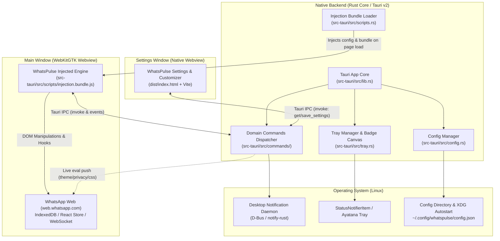
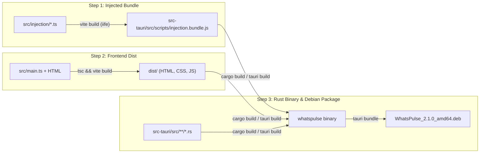

# WhatsPulse Technical Architecture Documentation

This document describes the internal software architecture, runtime execution pipeline, and design principles of **WhatsPulse**.

---

## 1. High-Level System Architecture

WhatsPulse is designed around a dual-process desktop architecture powered by **Tauri v2** and **WebKitGTK 4.1**. It pairs a high-performance native Rust core with a modular TypeScript frontend and an isolated injected runtime inside WhatsApp Web.



---

## 2. Injected TypeScript Engine (`src/injection/`)

Rather than relying on untyped, concatenated JavaScript files, WhatsPulse features a strongly-typed injection engine written in TypeScript under [`src/injection/`](file:///home/v0idbr/Dev/whats-rs/src/injection/).

### Compilation Pipeline
1. **Source Code**: Located in `src/injection/modules/*.ts` and `src/injection/index.ts`.
2. **Bundler**: Bundled into a standalone Immediately Invoked Function Expression (IIFE) via [`vite.injection.config.ts`](file:///home/v0idbr/Dev/whats-rs/vite.injection.config.ts).
3. **Artifact**: Output to [`src-tauri/src/scripts/injection.bundle.js`](file:///home/v0idbr/Dev/whats-rs/src-tauri/src/scripts/injection.bundle.js) (~42 KB minified, ~12 KB gzipped).
4. **Rust Embedding**: Embedded at compile time via `include_str!("scripts/injection.bundle.js")` in [`src-tauri/src/scripts.rs`](file:///home/v0idbr/Dev/whats-rs/src-tauri/src/scripts.rs).

### Module Breakdown

| Module | File | Purpose & Responsibilities |
|:---|:---|:---|
| **Types** | [`types.ts`](file:///home/v0idbr/Dev/whats-rs/src/injection/types.ts) | Defines `WhatsPulseApi`, `WhatsPulseBridge`, `WhatsPulseInjectedConfig`, and window augmentations. |
| **IPC Bridge** | [`ipc.ts`](file:///home/v0idbr/Dev/whats-rs/src/injection/ipc.ts) | Encapsulates `window.__TAURI__.core.invoke` calls, error reporting, and bridge helpers. |
| **Bootstrap** | [`modules/bootstrap.ts`](file:///home/v0idbr/Dev/whats-rs/src/injection/modules/bootstrap.ts) | Sets up `window.__whatspulse`, polyfills HTML5 `Notification` to trigger native desktop alerts, intercepts panic shortcut (`F12`), and tracks unread count via `<title>` mutation observer. |
| **Theme Control** | [`modules/theme-control.ts`](file:///home/v0idbr/Dev/whats-rs/src/injection/modules/theme-control.ts) | Drives WhatsApp Web's internal theme state (WAWeb modules, React store, DOM attributes, localStorage), custom palettes (AMOLED, Catppuccin, Nord, Dracula, etc.), custom CSS, and wallpaper. |
| **Privacy Blur** | [`modules/privacy-blur.ts`](file:///home/v0idbr/Dev/whats-rs/src/injection/modules/privacy-blur.ts) | Injects granular CSS filters (messages, media, text input, avatars, contact names), provides instant hover unblur, and manages the idle veil protection overlay. |
| **Nav Settings** | [`modules/nav-settings.ts`](file:///home/v0idbr/Dev/whats-rs/src/injection/modules/nav-settings.ts) | Clones native rail buttons to inject WhatsPulse Settings and Direct Chat icons into WhatsApp Web's left navigation bar. Provides in-page direct chat dialog. |
| **Chat List Collapse** | [`modules/chat-list-collapse.ts`](file:///home/v0idbr/Dev/whats-rs/src/injection/modules/chat-list-collapse.ts) | Toggles the chat list sidebar between normal width and a compact 97px avatar strip (Telegram-style). |
| **Connection Watchdog** | [`modules/connection-watchdog.ts`](file:///home/v0idbr/Dev/whats-rs/src/injection/modules/connection-watchdog.ts) | Monitors WhatsApp WebSocket connections to detect network drops and suspended states. |
| **Storage Persist** | [`modules/storage-persist.ts`](file:///home/v0idbr/Dev/whats-rs/src/injection/modules/storage-persist.ts) | Overrides `navigator.storage.persist()` and `persisted()` to return `true`, preventing data eviction prompts. |
| **SW Recovery** | [`modules/sw-recovery.ts`](file:///home/v0idbr/Dev/whats-rs/src/injection/modules/sw-recovery.ts) | Automatically self-heals broken or corrupt Service Worker registrations by unregistering and refreshing without clearing user session. |

---

## 3. Frontend Settings Architecture (`src/`)

The Settings and customization UI is built with TypeScript and Vite, following the Single Responsibility Principle:

```
src/
├── types/
│   └── config.ts                 # Strongly-typed configuration interfaces (AppConfig, WindowConfig, etc.)
├── services/
│   ├── tauri.ts                  # Pure IPC service calling backend Tauri commands
│   └── toast.ts                  # Non-blocking user toast notification helper
├── modules/
│   ├── navigation.ts             # Tab switching, header close, and global shortcuts (Esc, F12)
│   ├── appearance.ts             # Theme presets, Monaco/Stylus custom CSS editor, wallpaper, zoom
│   ├── privacy.ts                # Master privacy toggle, blur checkboxes, slider, idle veil, live simulator
│   ├── notifications.ts          # Sound, DND, quiet hours schedule, icon badge modes, test alert
│   ├── general.ts                # Autostart on boot, close-to-tray, tray toggles, updater, about window
│   └── direct-chat.ts            # Direct chat modal, phone number sanitization, and launch
├── main.ts                       # Slim bootstrap orchestrator (43 lines)
└── styles.css                    # Unified design system stylesheet
```

### Decoupled State & Live Synchronization Flow
When the user modifies a setting (e.g. adjusts blur radius or switches to AMOLED theme):
1. The domain module updates `currentConfig`.
2. `saveCurrentSettings()` dispatches `invoke("save_settings", { newConfig })`.
3. Backend updates the shared config on disk (`~/.config/whatspulse/config.json`).
4. Backend immediately evaluates live update JavaScript on the active WhatsApp Webview (e.g. `window.__whatspulseSetTheme('amoled')`), applying changes in real time without reloading the page.

---

## 4. Backend Rust Command Architecture (`src-tauri/src/commands/`)

All Tauri IPC commands are organized into focused domain modules under [`src-tauri/src/commands/`](file:///home/v0idbr/Dev/whats-rs/src-tauri/src/commands/):

```
src-tauri/src/commands/
├── mod.rs                        # Re-exports all commands to maintain zero breaking changes
├── autostart.rs                  # Linux XDG autostart .desktop file management
├── client.rs                     # Client logging, script error reporting, connection updates
├── direct_chat.rs                # International phone sanitization (e.g. 08xx -> 628xx) & URL dispatch
├── notification.rs               # Desktop notification trigger with custom icons, badge count
├── settings.rs                   # Thread-safe config get/save and live Webview push
├── updater.rs                    # Integration with GitHub Releases via Tauri updater
└── window.rs                     # Window lifecycle (show/hide/focus) and emergency Panic Mode
```

### Concurrency & Thread-Safety
The application configuration is held in `SharedConfig`, which is an `Arc<Mutex<AppConfig>>`.
To eliminate potential deadlocks:
- Locks are acquired with minimal scope and immediately dropped before performing foreign window evals or system tray mutations.
- Notification action listener threads are spawned independently and do not block the Tauri main event loop.

---

## 5. Security Model & Sandboxing

1. **Context Isolation**: WhatsApp Web runs inside its own isolated WebKitGTK Webview (`main`). The Settings window runs in a separate Webview (`settings`).
2. **IPC Scope Restriction**: Injected scripts in WhatsApp Web only have access to whitelisted IPC commands declared in `build.rs` and `capabilities/default.json`. Arbitrary shell execution is impossible from the webview.
3. **Local Credentials & Privacy**:
   - Authentication tokens and session keys are stored strictly in the user's local WebKit data directory (`~/.local/share/whatspulse/` or `WebKitGTK` profile).
   - WhatsPulse contains zero external telemetry, tracking, or analytics.
   - All network traffic flows directly between WhatsApp Web and WhatsApp's official servers (`*.whatsapp.net`, `*.whatsapp.com`).

---

## 6. Build & Distribution Pipeline



### Build Commands
- `pnpm run build:injection`: Compiles `src/injection/` into `src-tauri/src/scripts/injection.bundle.js`.
- `pnpm run build`: Type-checks with `tsc`, compiles the injection bundle, and produces `dist/`.
- `cargo test`: Executes all Rust unit tests (phone sanitizers, icon resolvers, config serde, script bundles).
- `pnpm tauri build`: Packages the native Linux binary and `.deb` bundle into `src-tauri/target/release/bundle/`.
